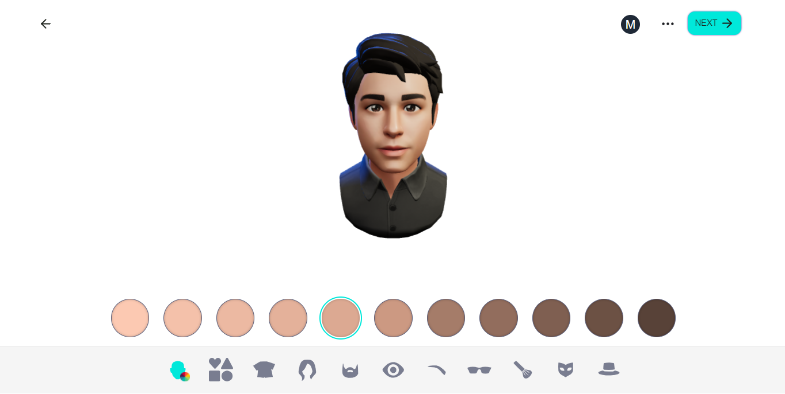

# Ngx Profile Avatar

Interactive 3D Avatar Profile Viewer generated in Ready Player Me

## Demos

### Cursor Tracker

> The rotation of the model, head, eyes and neck will react to the movement of the cursor.


### Face Tracker

> Model rotation, head, neck and facial animations will react to your expressions and movements detected by the camera.


## Generate your 3D Avatar

1. Navigate to the following url: [vr.readyplayer.me/avatar](https://vr.readyplayer.me/avatar).
1. Customize the look of your 3D avatar.
1. When finished, copy the generated link to the file with extension `.glb` or download the file and add it to the `assets` folder of your project in `Angular`.



## Instala NgxProfileAvatar

1. Install the library in your project with the command: `npm install @michaelldev/ngx-profile-avatar`.
1. Import `NgxProfileAvatarModule` in your `app.module`.

```typescript
import { BrowserModule } from '@angular/platform-browser';
import { NgModule } from '@angular/core';
import { AppComponent } from './app.component';

import { NgxProfileAvatarModule } from '@michaelldev/ngx-profile-avatar';

@NgModule({
  declarations: [AppComponent],
  imports: [
    BrowserModule,
    AppRoutingModule,
    //...
    NgxProfileAvatarModule,
  ],
  providers: [],
  bootstrap: [AppComponent]
})
export class AppModule { }
```

1. Use the `ngx-profile-avatar` component as the example below:

```html
<ngx-profile-avatar url="assets/avatar.glb" tracker="cursor" width="100vw" height="100vh" (onLoading)="onLoadingAvatar($event)">
</ngx-profile-avatar>
```

1. Component documentation

| Input         | Description | Type | Default |
|:--------------|:------------|:-----|:--------|
| `[url]` | Public or local location of the `.glb` file containing the 3d model of your avatar. | `string` | `null` |
| `[tracker]` | Reaction method of your model.| `'cursor' 'face'` | `'cursor'` |
| `[width]` | Width of the canvas.| `string` | `'100vw'` |
| `[height]` | Height of the canvas.| `string` | `'100vh'` |
| `(onLoading)` | Emitter of `.glb` file loading progress event.| `EventEmitter<ProgressEvent>` | `-` |

> **Important**
>
> Preferably, define tracker as `cursor` . The `face` option is still experimental.
